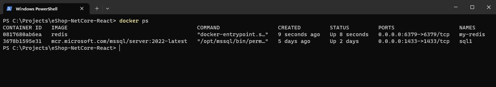
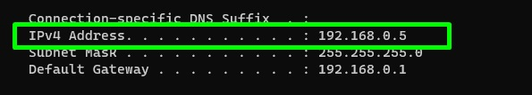
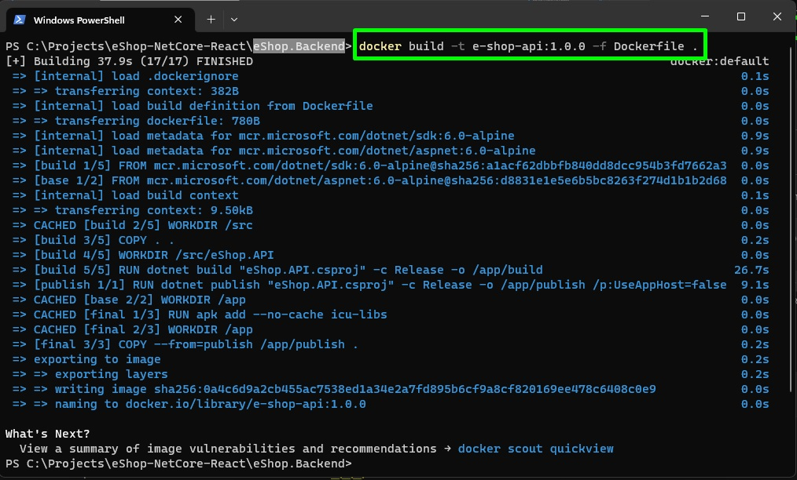
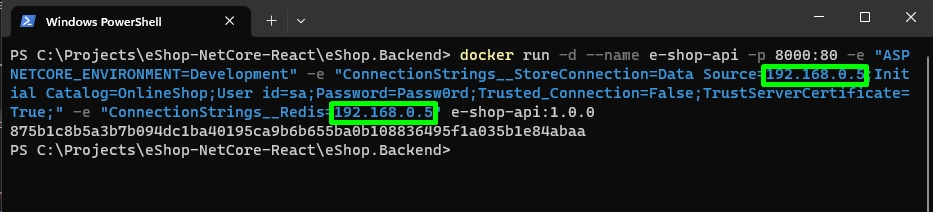
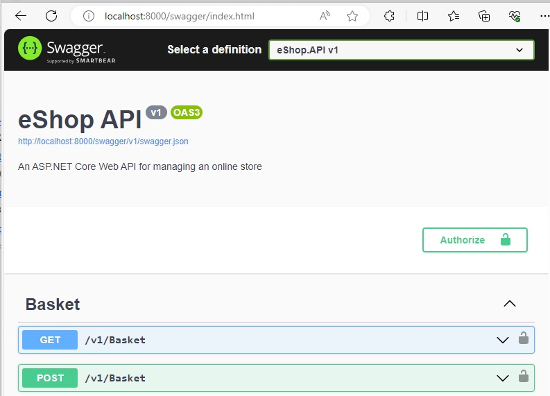
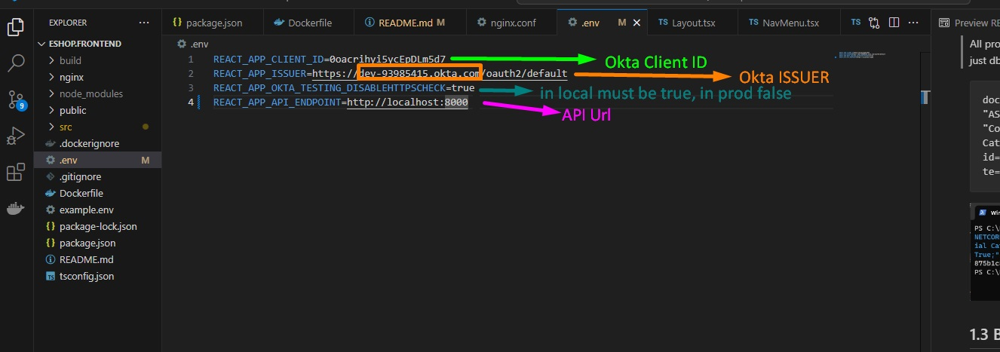

# eShop-NetCore-React

## Disclaimer

Tha api project has the design patterns Repository, Unit of work, Dependency Injection, CQRS, Mediator and you must check if makes sense implement all of them.

##  0. Prerrequisites 

This project requires a MS SQL Server and a Redis Server runing, and docker CLI (Could be Docker Desktop or Rancher Desktop) all the docker commands must be  executed in a terminal

### 0.1 SQL SERVER

If you don't have a sql server you can create a local one with the docker CLI, in the environment variable **MSSQL_SA_PASSWORD** set the password you want for the server in this case we will set **Passw0rd** : 

```
docker run -e "ACCEPT_EULA=Y" -e "MSSQL_SA_PASSWORD=Passw0rd" -p 1433:1433 --name sql1 --hostname sql1 -d mcr.microsoft.com/mssql/server:2022-latest
```

### 0.2 Redis

If you don't have a redis server you can create a local one with the docker CLI: 

```
docker run --name my-redis -p 6379:6379 -d redis
```

### 0.3 Correct configuration

so far you have the db servers set:



### 0.4 Get your localhost ip required to set the db in the api (for dockerized db servers, if you have a real server skip this step)

In a terminal run the next command and take note of the fist IPv4 Address you see, in this case is 192.168.0.5:

```
ipconfig
```


## 1.0 API

Steps to run the containerized API

## 1.1 Build API image

In this case we will create an image with name **e-shop-api** and tag **1.0.0** in the **eshop.Backend** folder

```
docker build -t e-shop-api:1.0.0 -f Dockerfile .
```



## 1.2 Run API image

Execute the docker run command, set the correct connection strings in the environment variables **ConnectionStrings__StoreConnection** and **ConnectionStrings__Redis** in this case the server is **192.168.0.5** obtained from the ipconfig command in previous steps.

All properties from **appsettings.json** can be set as enviroment variables in this step for now just db connection strings

```
docker run -d --name e-shop-api -p 8000:80 -e "ASPNETCORE_ENVIRONMENT=Development" -e "ConnectionStrings__StoreConnection=Data Source=192.168.0.5;Initial Catalog=OnlineShop;User id=sa;Password=Passw0rd;Trusted_Connection=False;TrustServerCertificate=True;" -e "ConnectionStrings__Redis=192.168.0.5" e-shop-api:1.0.0
```



## 1.3 Browse API Swagger doc

Now you can browse tha api swagger in the url:
```
http://localhost:8000/swagger/index.html
```



## 2.0 SPA

Steps to run the containerized API (The SPA needs more work I know but this is just a demo )

### 2.1 Set SPA env variables

open the **.env** file in the **eshop.frontend** folder and set the correct spa environment variables (Okta and API envs)




### 2.2 Build SPA image

In this case we will create an image with name **e-shop-spa** and tag **1.0.0** in the **eshop.frontend** folder

```
docker build -t e-shop-spa:1.0.0 -f Dockerfile .
```


